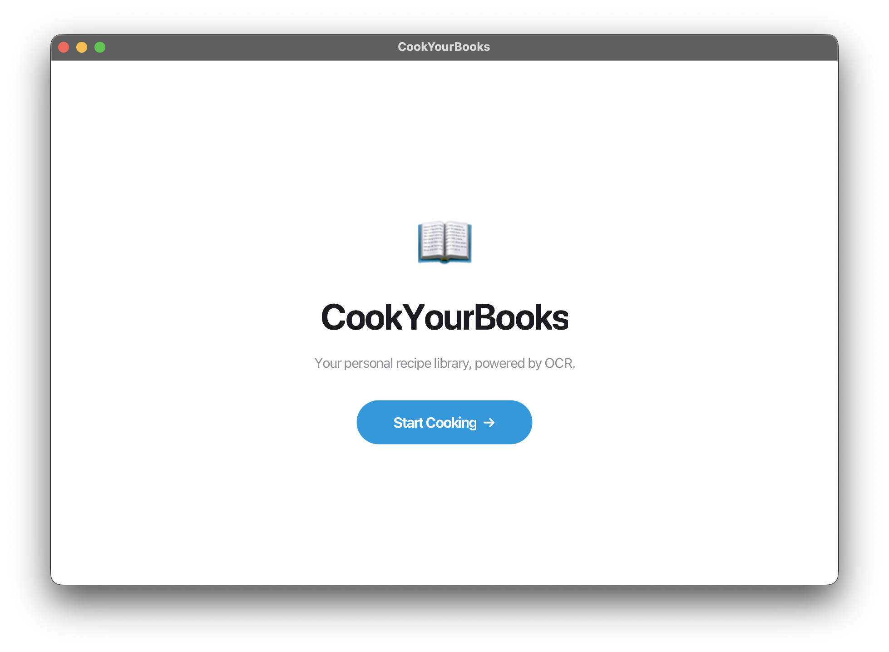

# CookYourBooks

A desktop application for managing your personal recipe library. Import recipes from photos using OCR, organize them into collections, search by ingredient, convert units, and plan meals.



## Overview

CookYourBooks centralizes recipe management for home cooks: import a recipe by photographing a cookbook page, edit and organize it alongside the rest of your collection, and pull it back up in the kitchen with step-by-step cook mode.

### Features

- **Recipe Library** — Browse and manage recipes organized into custom collections
- **OCR Import** — Extract recipes from photos using the Google Gemini API
- **Recipe Editor** — Create and edit recipes, including ingredients and instructions
- **Search & Filter** — Find recipes by name, ingredient, or collection
- **Unit Conversion** — Convert measurements between imperial and metric
- **Meal Planning** — Scale recipes and generate shopping lists
- **Cook Mode** — Step-by-step guidance while cooking

## Running

**Build everything (compile, test, checkstyle, format):**
```bash
./gradlew build
```

**Run the GUI app:**
```bash
./gradlew run
```
This launches `CookYourBooksGuiApp`, which loads `cyb-library.json` from the project root.

**Run the CLI app:**
```bash
./gradlew shadowJar && java -jar build/libs/cookyourbooks-all.jar
```

**Run tests:**
```bash
./gradlew test
```

**Auto-format code:**
```bash
./gradlew spotlessApply
```

## Gemini API Setup (Import Feature)

The Import feature uses Google's Gemini API to extract recipes from images.

### Setting Up Your API Key

1. **Get a Gemini API key** from [Google AI Studio](https://aistudio.google.com/apikey) (free tier is fine)

2. **Create a `.env` file** in the project root (next to `build.gradle`):
    ```bash
    cp .env.example .env
    ```

3. **Add your API key** to `.env`:
    ```
    GOOGLE_API_KEY=your-actual-api-key-here
    ```

The app automatically loads `.env` at startup via `dotenv-java`. The `.env` file is in `.gitignore`, so your key won't be committed.

**Alternative:** You can also export `GOOGLE_API_KEY` as a shell environment variable if you prefer.

**Important:** Never commit your API key, always use `.env` or environment variables.
