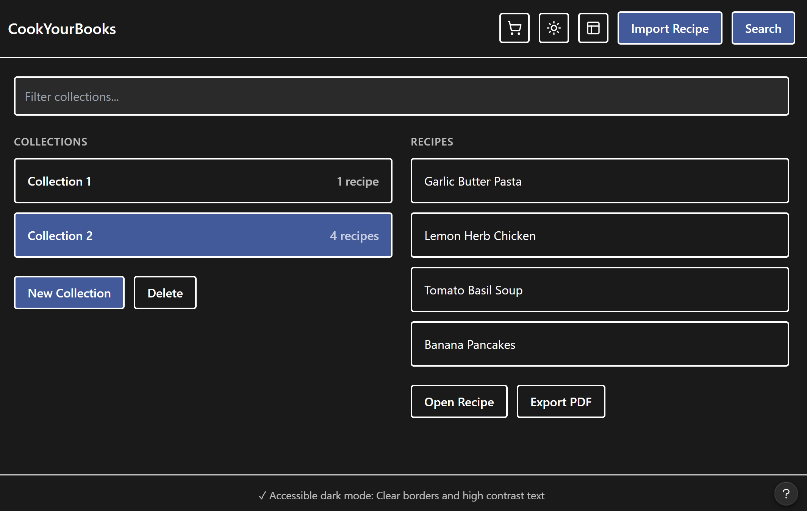
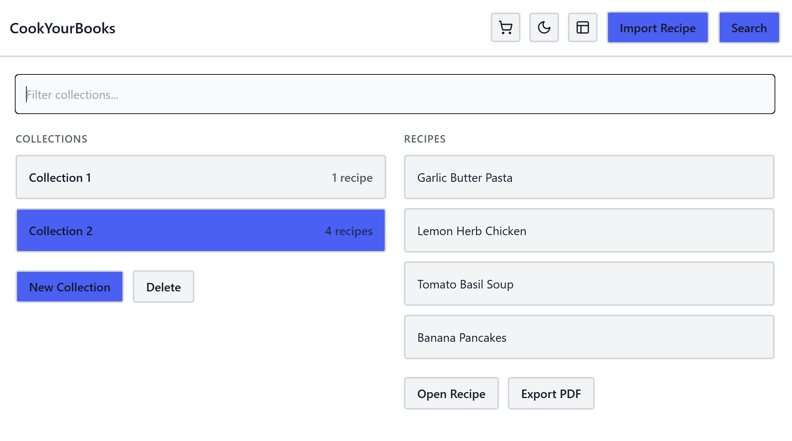
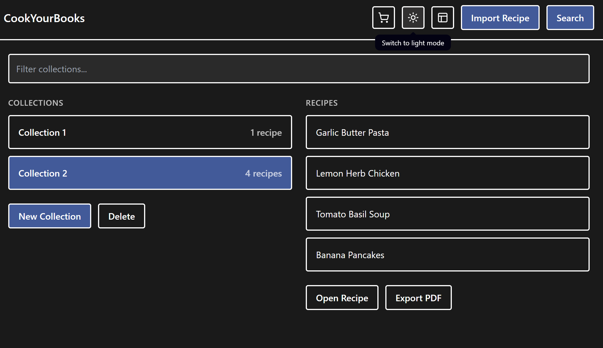

# Dark Mode — Feature Summary

## Screenshots

### Light Mode (default)
The app starts in light mode. The top bar has a sun icon button (☀) that the user can click to switch to dark mode.

### Dark Mode — V1

Clicking the ☀ button adds the dark CSS to the Scene's stylesheet list. The entire app switches to a dark navy/charcoal color scheme with light text. Clicking the button again removes the dark CSS and returns to light mode.

### Dark Mode — V2

Version 2 makes the toggle button icon switch on every click. When the app is in light mode the button shows 🌙, and when it is in dark mode the button shows ☀. This directly fixes the most confusing part of V1 — the button now tells the user what it will do before they click it.

### Dark Mode — V3

Version 3 adds a Tooltip to the toggle button. Hovering over the button now shows a plain-English label that describes what the next click will do — "Switch to dark mode" in light mode, and "Switch to light mode" in dark mode. The tooltip updates on every click so it always stays in sync with the current state.

## Integration Notes

Dark mode is wired into the main application layout and applies to all views at once.

- **ThemeManager** (`src/main/java/app/cookyourbooks/gui/ThemeManager.java`) holds the toggle logic and the `isDarkMode` BooleanProperty. It adds or removes `cookyourbooks-dark.css` from the Scene's stylesheet list when toggled. It also reads and writes the dark mode preference using `java.util.prefs.Preferences` so the user's choice is remembered between launches. When the Scene is set, it immediately applies the saved preference.
- **MainViewController** (`src/main/java/app/cookyourbooks/gui/view/MainViewController.java`) holds the toggle button. Its `setThemeManager()` method connects the button click to `ThemeManager.toggle()`. On startup, `initialize()` checks the saved preference and sets the button icon and tooltip to match before the user clicks anything.
- **CookYourBooksGuiApp** (`src/main/java/app/cookyourbooks/gui/CookYourBooksGuiApp.java`) creates the `ThemeManager`, passes it to `MainViewController`, and calls `themeManager.setScene(scene)` after the Scene is built.
- **cookyourbooks-dark.css** (`src/main/resources/css/cookyourbooks-dark.css`) contains all the dark color overrides. Every selector is prefixed with `.root` so it has higher specificity than the light CSS loaded by FXML, which makes the dark colors actually win. Selected list items also have a white left border so the selection state is visible without relying on color alone.

The dark CSS applies to all panels at the same time — library view, recipe editor, import, and search all go dark together. No per-view changes were needed.

## Status

| Item | Status |
|---|---|
| Toggle button wired to ThemeManager | ✅ Complete |
| Dark CSS applied to whole app | ✅ Complete |
| Light mode restored on second click | ✅ Complete |
| Unit tests (ThemeManagerTest.java) | ✅ Complete — 4 tests passing |
| Keyboard accessible (Tab + Space) | ✅ Complete |
| Button icon switches 🌙 ↔ ☀ on toggle | ✅ Complete — fixed in V2 |
| Tooltip on toggle button (updates on click) | ✅ Complete — fixed in V3 |
| Color blindness — white left border on selected items | ✅ Complete |
| Theme persists between launches | ✅ Complete — saved via java.util.prefs |

## What's Still Not Done

- **Bottom action buttons look faint in dark mode.** The Delete, Open Recipe, and Export PDF buttons have low contrast in dark mode. They look disabled even when they are active. Fixing this would require adding higher-contrast color overrides for those button states in `cookyourbooks-dark.css`.
- **Tooltip not reachable by keyboard.** JavaFX tooltips do not receive keyboard focus, so users who navigate entirely by keyboard cannot access the tooltip text without a mouse hover.
