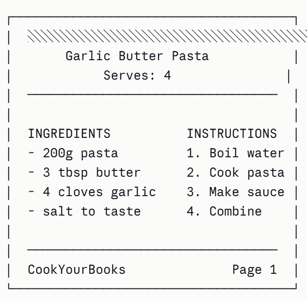

# Export to PDF — Feature Summary

## Screenshots

### Export PDF Button in Library View
The "Export PDF" button appears in the bottom-right area of the Library View, next to "Open Recipe" and "Delete". It is disabled (greyed out) when no recipe is selected, and becomes active once the user clicks a recipe in the list.

### File Chooser Dialog
Clicking "Export PDF" opens the operating system's native save dialog. The filename is pre-filled with the recipe title (e.g. `Garlic Butter Pasta.pdf`). The user chooses where to save the file and confirms.

### Generated PDF Output (V2)

The exported PDF contains:
- A grey header block with the recipe title and serving count centered
- A horizontal divider line separating the header from the body
- A two-column body layout: **INGREDIENTS** on the left, **INSTRUCTIONS** on the right
- A thin vertical rule between the two columns
- A footer on every page: "CookYourBooks" on the left, "Page N of M" on the right

## Integration Notes

The Export PDF feature is wired into the existing Library View MVVM stack and does not require any new views or navigation.

- **PdfExporter** (`src/main/java/app/cookyourbooks/adapters/PdfExporter.java`) is the adapter responsible for rendering a `Recipe` domain object into a formatted A4 PDF. It has no dependency on JavaFX and can be used independently of the UI.
- **LibraryViewModel** (`src/main/java/app/cookyourbooks/gui/viewmodel/LibraryViewModel.java`) exposes `exportRecipe(String recipeId, Path outputPath)`. The implementation in `LibraryViewModelImpl` looks up the recipe via `LibrarianService.listAllRecipes()` and delegates to `PdfExporter` on a background thread using `BackgroundTaskRunner`.
- **LibraryViewController** (`src/main/java/app/cookyourbooks/gui/view/LibraryViewController.java`) handles the button click. It opens a `FileChooser` on the FX thread, collects the save path from the user, then calls `vm.exportRecipe()`. A confirmation `Alert` appears after the export is triggered.
- **LibraryView.fxml** (`src/main/resources/fxml/LibraryView.fxml`) already contained the `exportButton` node from GA1. Only the button text was updated from `"Export"` to `"Export PDF"`.

## Status

| Item | Status |
|------|--------|
| Export PDF button in Library View | Complete |
| FileChooser for save path selection | Complete |
| V1 plain text PDF layout | Complete |
| V2 formatted layout (header, two-column, footer) | Complete |
| Export runs on background thread (UI stays responsive) | Complete |
| Unicode character sanitization | Complete |
| Automatic word-wrap for long instruction text | Complete |
| Automatic pagination for long recipes | Complete |
| Unit tests (PdfExporterTest.java) | Complete — 9 tests passing |
| Keyboard accessible (Tab + Enter) | Complete |
| Font supports Latin-1 only (no Unicode fonts embedded) |  UnKnown |
| Recipe images not included in PDF | UnKnown |
| Page size fixed to A4 | UnKnown |
