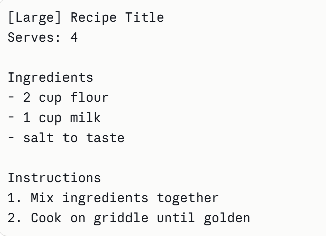
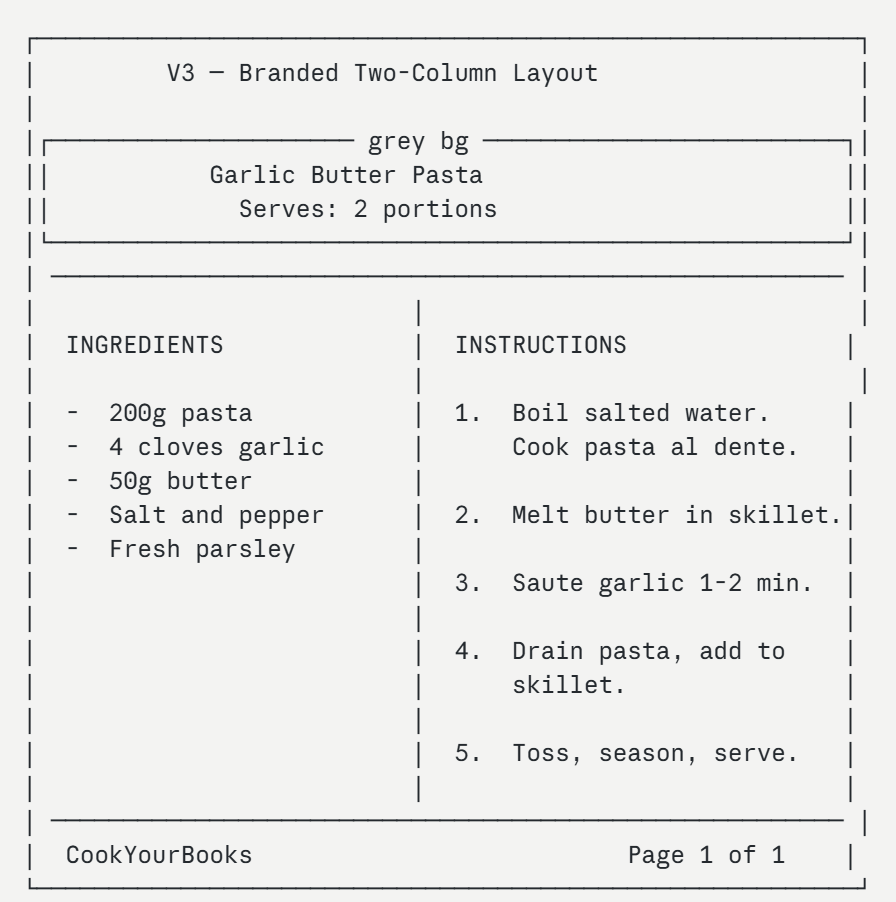

# Export to PDF — Design Evolution

## Version 1: Plain Text Layout

**Screenshot:** `v1-wireframe.png`

Version 1 was the first working implementation of the PDF export. The goal was to get the recipe data onto a page in a readable order. The layout was a simple top-to-bottom single column:

- Recipe title displayed as plain text at the top left
- Serving count directly below the title
- "Ingredients" section heading followed by a dashed list of ingredients
- "Instructions" section heading followed by numbered steps
- No visual decoration, dividers, or page structure

The PDF was functional — all recipe data appeared correctly, word-wrapping and automatic pagination worked, and Unicode characters were sanitized to prevent PDFBox encoding errors.

### Problems We Noticed in Version 1

After generating several real recipes with V1, we identified four issues:

1. **No visual hierarchy.** The title, section headings, and body text all looked similar in weight and size. A user scanning the page could not quickly locate the ingredients or steps.

2. **Wasted horizontal space.** Ingredient lists are usually short lines. Printing them in a full-width single column left the right half of the page completely empty, which looked unfinished.

3. **No page identity.** There was no indication of which app produced the PDF, and no page number on multi-page recipes. A printed page with no label could be confused with any other document.

4. **Plain appearance does not match "nicely formatted."** The assignment requirement specifically asks for a nicely formatted PDF. V1 looked like raw terminal output, not a document a food critic like Jimmy would want to hand to a colleague.

---

## Version 2: Structured Single-Column Layout

**Wireframe:** `v2-wireframe.svg`

Based on the problems found in V1, Version 2 introduced a clear typographic structure without changing the single-column layout:

- **Bold, larger title** left-aligned at the top — establishes an immediate visual entry point so the reader's eye lands on the recipe name first
- **Smaller grey serving count** below the title — visually subordinate to the title, creating a two-level text hierarchy
- **Horizontal divider lines** between the title block and Ingredients, and between Ingredients and Instructions — give the reader clear section boundaries without any colour
- **Bold uppercase section headings** (`INGREDIENTS`, `INSTRUCTIONS`) — easy to locate when scanning the page
- **Simple right-aligned page number** (`Page N of M`) in the footer — solves the missing page identity problem without adding branding yet

### Problems We Noticed in Version 2

After testing V2 with longer recipes, two issues remained:

1. **Horizontal space still wasted.** Adding bold headings improved readability but the right half of the page was still empty on ingredient-heavy recipes. A user printing a recipe with twelve ingredients and six steps would see a lot of blank space.

2. **No app identity.** The page number footer helped navigation, but a printed copy still had no indication it came from CookYourBooks. For Jimmy, who might file printed recipes alongside clippings from other sources, an unlabelled page looks no different from a printout from any other tool.

---

## Version 3: Formatted Layout with Branded Header and Two-Column Body

**Screenshot:** `v3-wireframe.png`

Based on the problems found in V2, Version 3 introduced a full visual design:

- **Grey header background block** spanning the full page width, containing the recipe title and serving count centered horizontally — makes the title immediately visible and gives the PDF a branded, document-like feel
- **Horizontal divider lines** separating the header from the body, and the body from the footer — creates clear visual zones so the reader's eye knows where to look
- **Two-column body layout** — INGREDIENTS on the left, INSTRUCTIONS on the right, separated by a thin vertical rule — uses the horizontal space efficiently and lets the reader see ingredients and steps side by side
- **Branded footer on every page** — "CookYourBooks" on the left and "Page N of M" on the right — gives the document identity and helps with multi-page recipes

### Why These Changes

The two-column layout directly addresses the wasted space problem from V2. Ingredients are typically short lines (e.g. `- 200g pasta`) while instructions are longer, so splitting them into parallel columns makes both sections easier to scan without the page feeling empty.

The branded header and footer address the identity problem. A user printing the recipe now gets a document that looks intentional and identifiable — exactly the kind of clean, shareable document a food critic like Jimmy would hand to a colleague or file with his physical clippings.

The divider lines carried over from V2 but were reinforced by the header block, giving the reader even clearer landmarks across the page.
