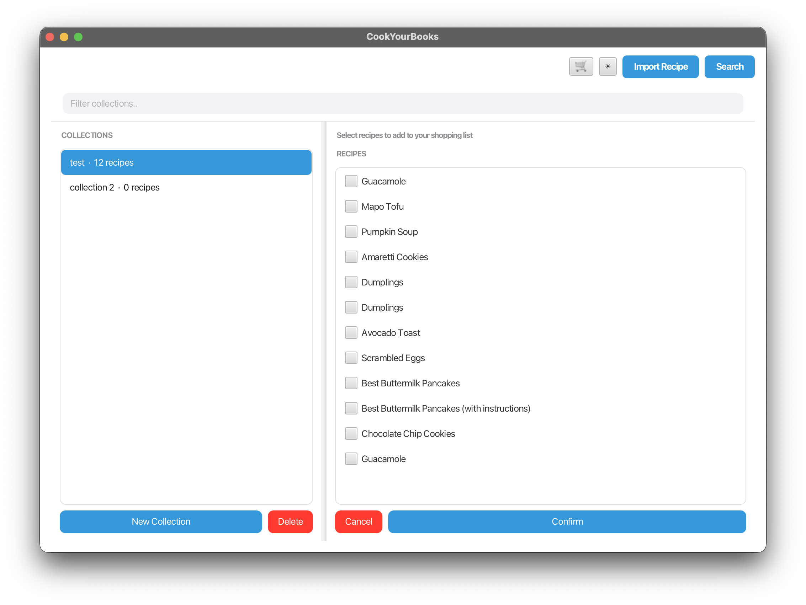
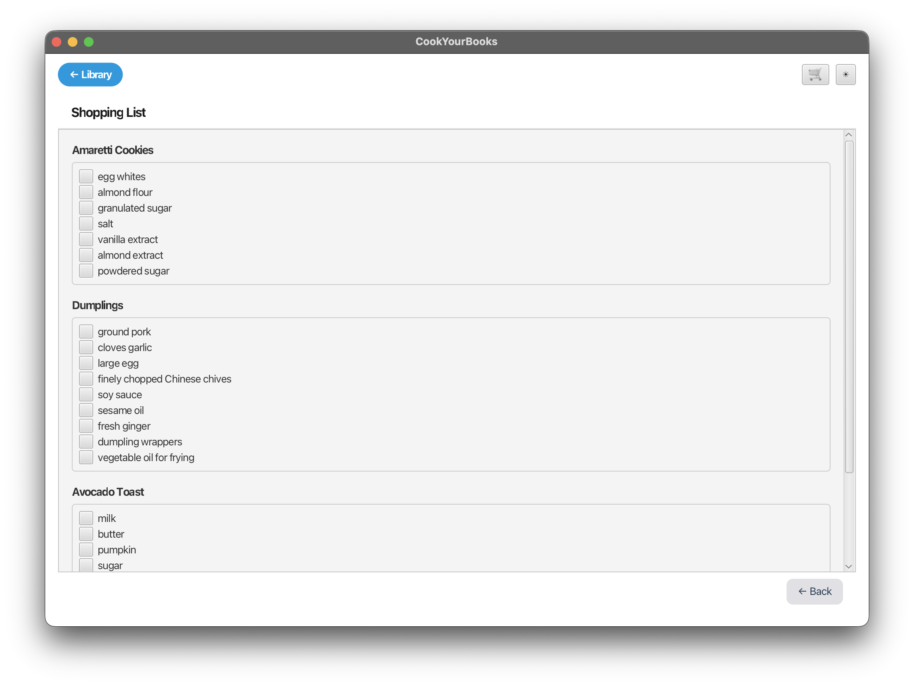
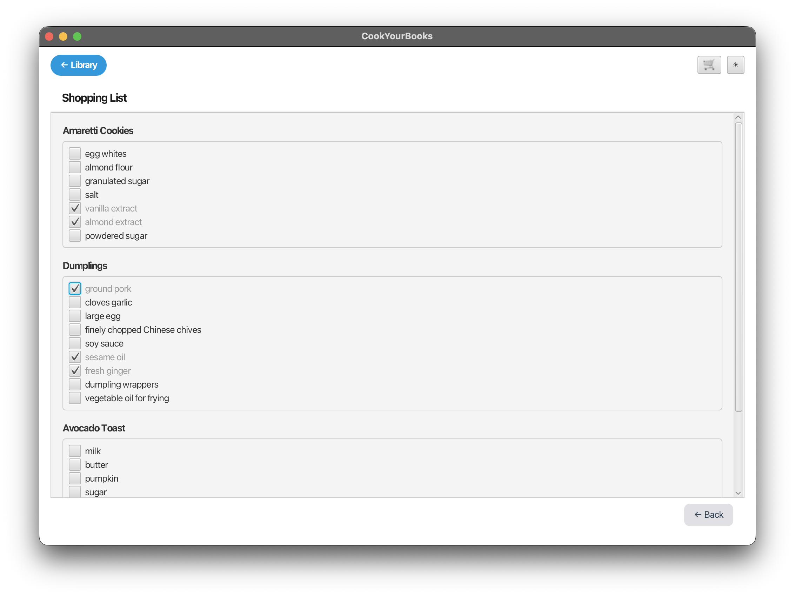
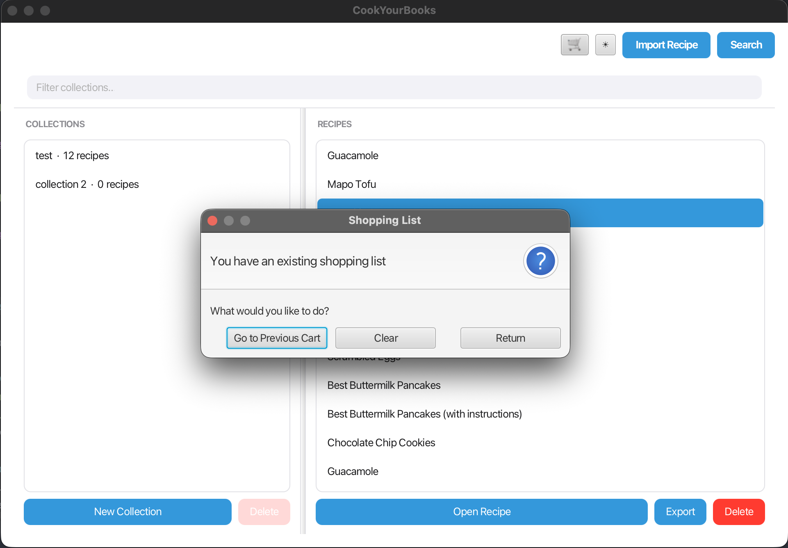
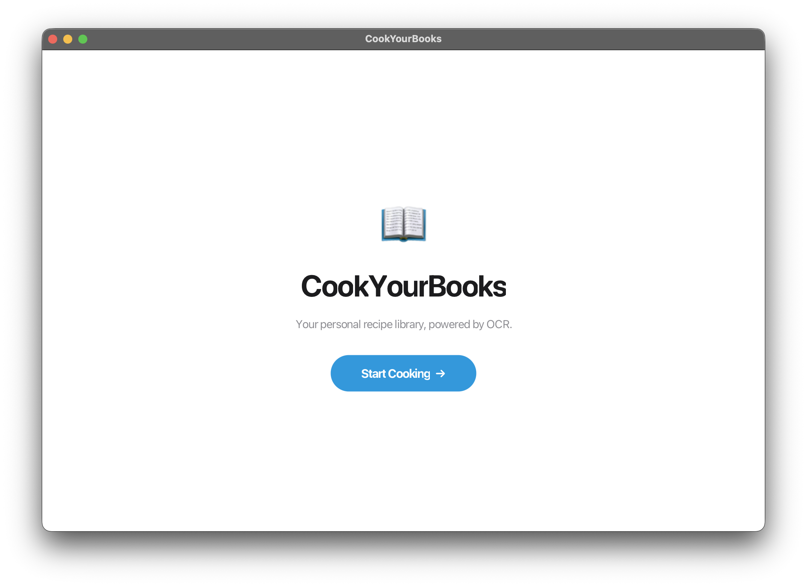
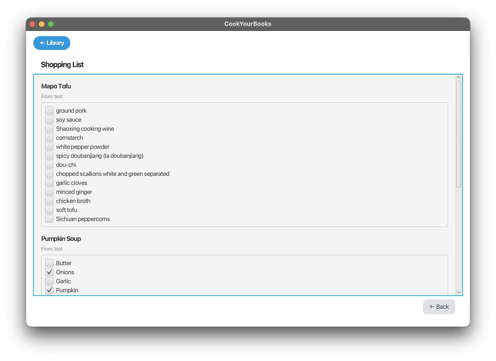
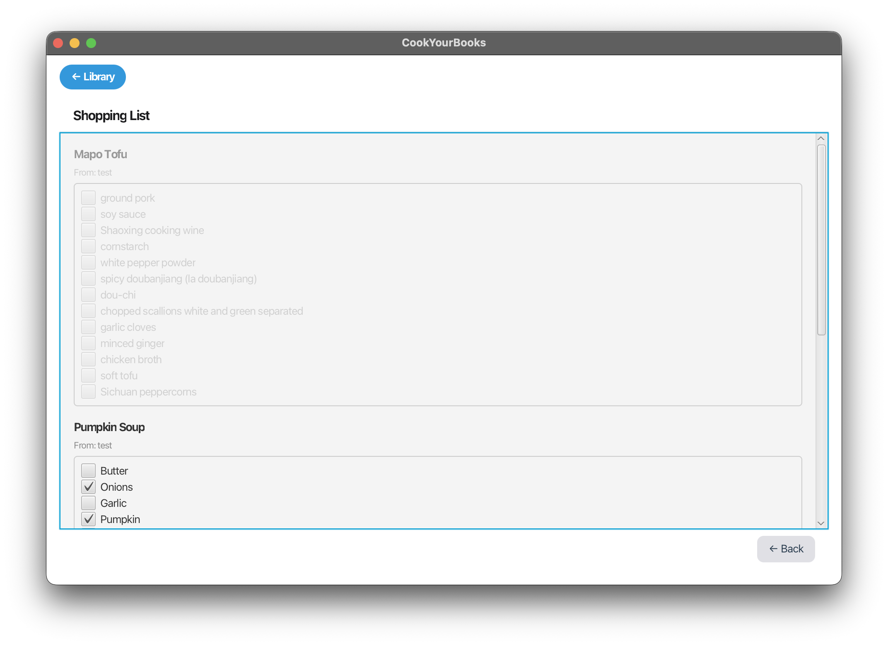

# Feature Summary: Shopping List Result Screen

---

## Screenshots

### v1

#### 1. Recipe Selection Mode


#### 2. Shopping List Result Screen


#### 3. Checked Items (Strikethrough)


---

### v2

#### 1. Shopping List Result Screen with Clear Button



#### 2. Library View — Cart Icon Hidden on Home Page



---

### v3

#### 1. Collection Subtitle Under Each Recipe Header



#### 2. Dismissed Section (Header + All Ingredients Grayed Out)



---

## Integration Notes

The Shopping List feature connects to the rest of the app at three points:

### NavigationService
`NavigationService.View.SHOPPING_LIST` was added to the navigation enum so
`MainViewController` can route to the result screen. The existing `showView()` logic
already handles the Back button visibility for any non-HOME, non-LIBRARY view.

### ShoppingListViewModel (recipe selection phase)
The selection phase (`ShoppingListViewModel` / `ShoppingListViewModelImpl`) was
implemented by a teammate in PR #5. It fires an `onConfirm` callback with the set of
selected recipe IDs. This feature wires into that callback in `CookYourBooksGuiApp`:

```java
new ShoppingListViewModelImpl(selectedIds -> {
    resultVm.load(new HashSet<>(selectedIds));
    navigationService.navigateTo(NavigationService.View.SHOPPING_LIST);
})
```

### LibrarianService
`ShoppingListResultViewModelImpl` calls `LibrarianService.listAllRecipes()` on a
background thread to resolve the selected recipe IDs into full `Recipe` objects. No new
service methods were needed the feature reuses the existing service layer.

### MainViewController (smart cart button)
The shopping cart button in `MainViewController` was updated to check whether a shopping
list already exists. If `resultVm.sectionsProperty()` is non-empty, the button navigates
directly to the result screen instead of entering selection mode. This required passing
`ShoppingListResultViewModel` as a third constructor parameter to `MainViewController`.

---

## Version History

| Version | Summary                                                                                   |
|---------|-------------------------------------------------------------------------------------------|
| v1      | Initial result screen — per-recipe grouping, checkboxes, strikethrough, smart cart button |
| v2      | Clear button added, cart icon hidden on Home page, button layout simplified               |
| v3      | Collection subtitle under each recipe header; click header to cross off entire section    |

---

## Status

### Complete (v1)
- `IngredientItem` and `RecipeSection` data classes
- `ShoppingListResultViewModel` interface and `ShoppingListResultViewModelImpl`
- `ShoppingListResultView.fxml` layout (toolbar, scrollable sections, Back button)
- `ShoppingListResultViewController` (dynamic section building, checkbox binding, strikethrough)
- Full wiring in `CookYourBooksGuiApp` (real `onConfirm` callback, `wireShoppingListResult()`)
- Smart cart button in `MainViewController` (existing list → navigate directly, no list → select)
- 7 unit tests (SL1–SL7) for `ShoppingListResultViewModelImpl`
- 3 integration tests (IT-SL1–IT-SL3) for the full callback chain

### Complete (v2)
- Clear button on result screen wired to reset sections and return to selection mode
- Cart icon and dark mode toggle hidden on Home page, visible only on Library view
- Button layout simplified — redundant back button removed

### Complete (v3)
- `RecipeSection` gains `collectionName` field and `dismissedProperty()`
- `ShoppingListResultViewModelImpl.buildSections()` resolves collection name via a
  single `listCollections()` call and a `recipeId → collectionTitle` lookup map
- `ShoppingListResultViewController` renders a "From: [Collection]" subtitle under
  each header and wires click-to-dismiss with section-wide gray + strikethrough
- Unit tests updated: `listCollections()` stubbed in setUp; SL8 and SL9 added

### Known Limitations
- Checked state is **in-memory only** — if the user navigates away and returns, all
  checkboxes reset to unchecked
- The Back button always returns to the Library view, not to whichever screen the user
  came from
