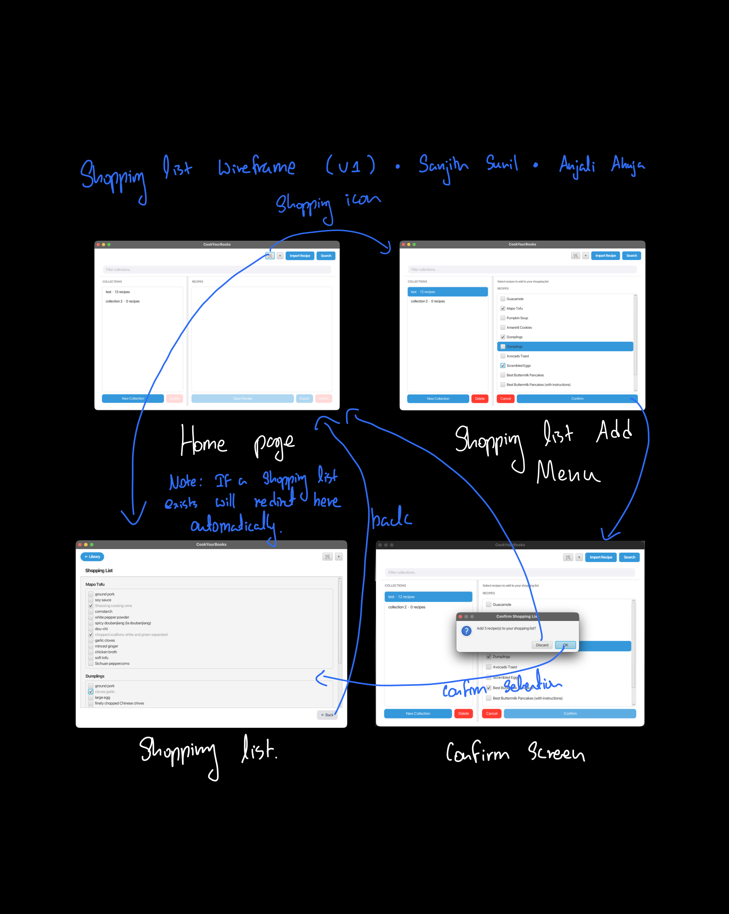
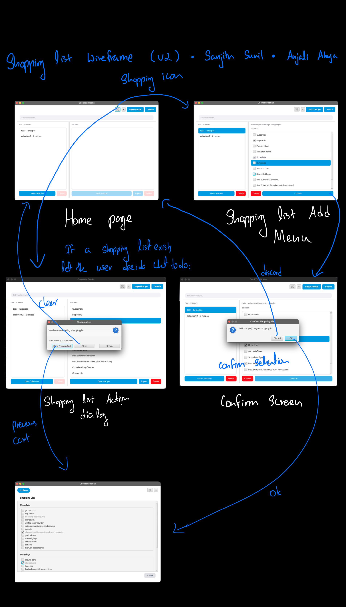

# Design Evolution: Shopping List Result Screen

---

## Version 1 — Initial Wireframe

**Artifact:** 

The V1 wireframe was sketched by hand and shows the full user flow across four screens:

1. **Home page** — the starting point; the user clicks the shopping cart icon in the sidebar
2. **Shopping List Add Menu** — the Library view enters selection mode, showing checkboxes
   next to each recipe so the user can pick what they want to cook
3. **Confirm Screen** — a dialog asks the user to confirm their selection before proceeding
4. **Shopping List** — the result screen listing all ingredients grouped by recipe, with
   checkboxes the user can tick off while shopping

A key design decision captured in the wireframe is the note:
> *"If a Shopping List exists, will redirect here automatically"*

This meant that pressing the cart button a second time should skip the selection flow
entirely and take the user straight back to their existing list — avoiding the frustration
of having to re-select recipes just to view what they already built.

### What the V1 wireframe established

- The shopping list is **grouped by recipe** (one bold header per recipe, ingredients listed below)
- Ingredients are **checkboxes**, not a plain read-only list
- The flow is linear: Home → Add Menu → Confirm → Shopping List
- The cart button is **context-aware**: new list → selection mode, existing list → skip straight to result

### What was left undefined in V1

- How checked items would be visually distinguished (strikethrough? color change? both?)
- Whether there would be a "clear list" or "start over" option
- The exact styling of the ingredient rows (bordered box vs. plain list)
- How the Back button would behave (return to Library vs. previous screen)

---

## Version 2 — Iteration Based on V1 Feedback

**Artifact:** 

After building and using V1, four problems were identified that prompted changes in V2:

### Problems found in V1

1. **No way to clear the list.** Once a shopping list was built, the only way to start
   over was to navigate back to the Library and confirm a new selection. There was no
   dedicated "clear" action on the result screen itself.

2. **The shopping cart icon appeared on the Home page.** The cart button was visible in
   the sidebar regardless of which view the user was on, including the Home screen where
   it made no sense contextually. It should only be accessible from the Library view.

3. **Button responsibilities were unclear.** V1 had a Back button that returned to
   the Library, but its relationship to "clearing the list" vs. "just navigating away"
   was ambiguous. Users had no clear path to start over without losing their current list.

4. **Too many buttons added complexity.** An early V2 attempt added three separate
   buttons (Exit, Clear, View Existing List) but this was found to be too complicated —
   users should not need three options to manage a single list.

### Changes made in V2

- *(Problem 1)* Added a **Clear** button to the result screen so the user can wipe the
  current list and start a new selection without navigating away first.
- *(Problem 2)* The shopping cart icon and dark mode toggle are now **hidden on the Home
  page** and only appear when the user is on the Library view — reducing sidebar clutter.
- *(Problem 3 & 4)* Iterated through several button layouts (three separate buttons →
  two buttons → final simplified version) and settled on keeping just the **Back** and
  **Clear** buttons. The duplicate back button introduced in one iteration was removed
  once it was clear it served the same purpose as the existing navigation.
